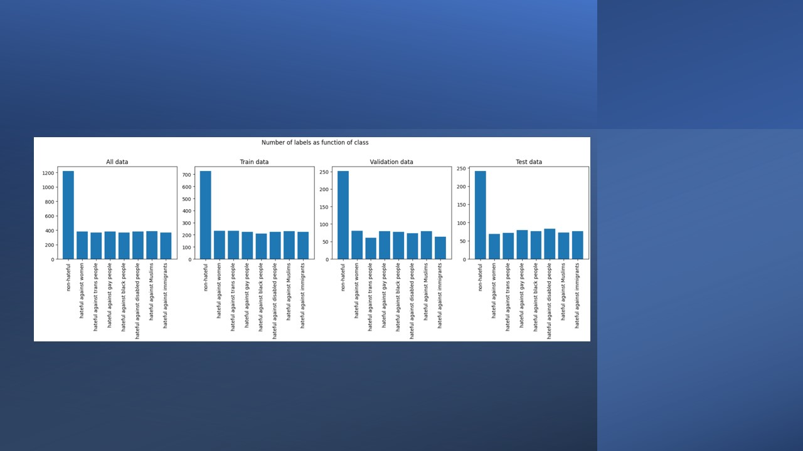
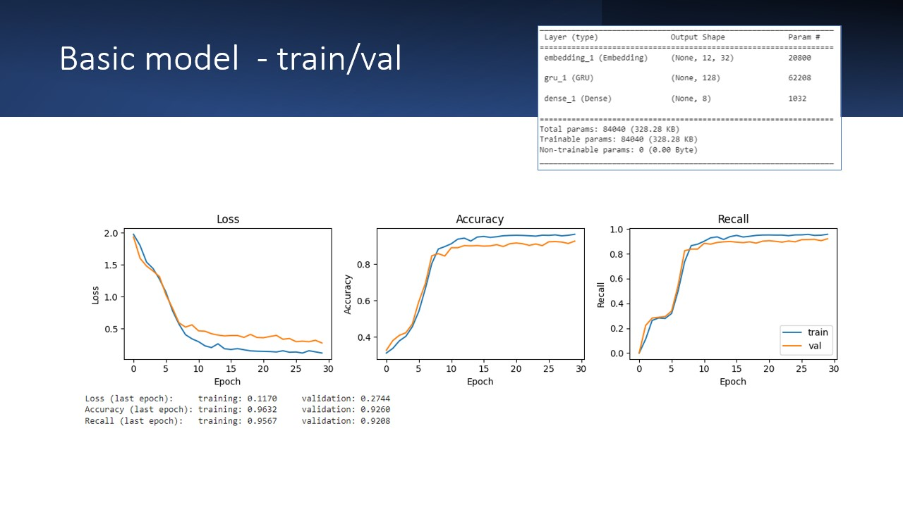
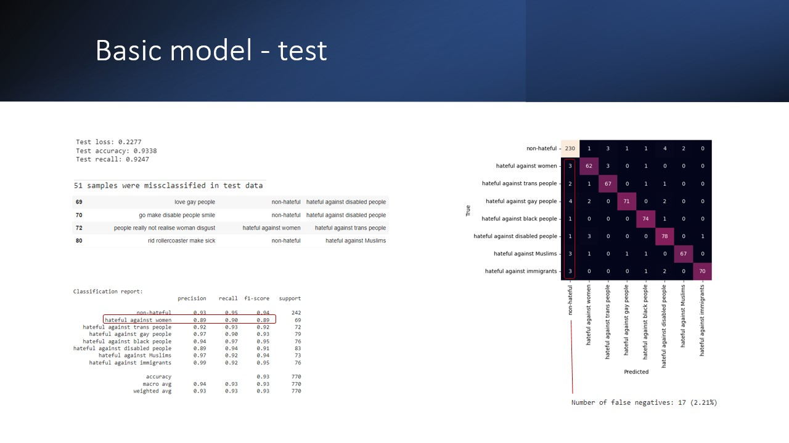
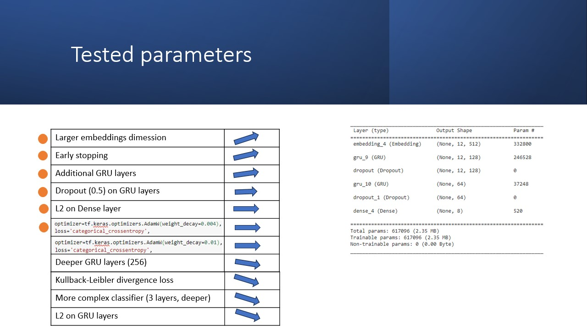
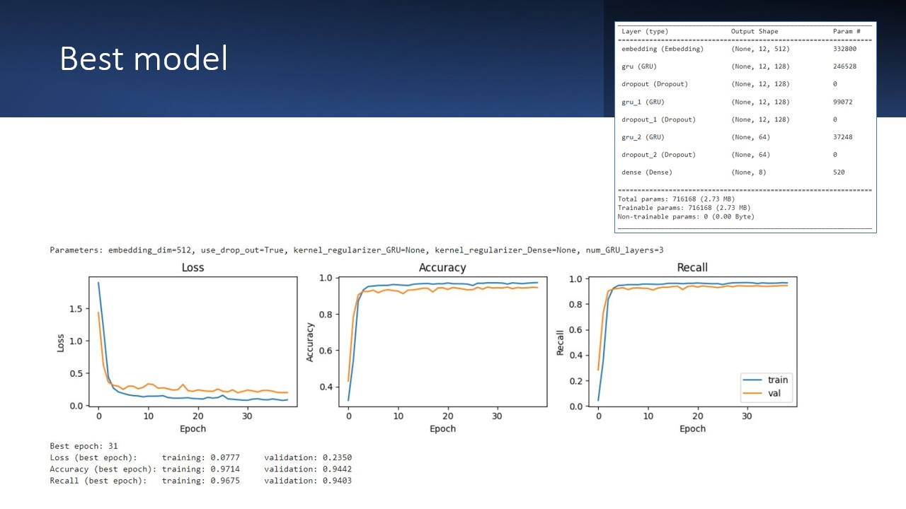
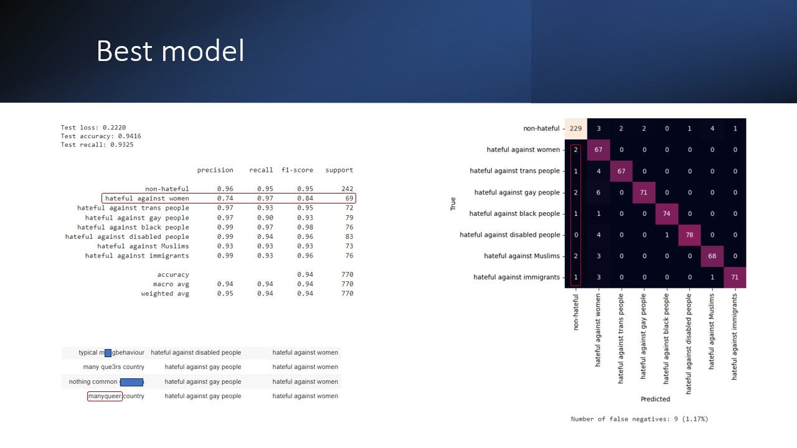

#  Detection and classification of hate-retoric
Issue: Forum group moderators need tools to efficiently discover hate retorics in blog text.​

Task: Create a model which can identify hate retoric and define target group. Bulid model from scratch (not transfer learning), explore manually and tune hyperparameters systematically.

---
*NOTE: Current lab is not aiming at defining optimal model. Focus is rather on roughly exploring some basic concepts using very limited hardvare resources (CPU or GoogleColab limited GPU).*

---
---
  

# Description
Original data consists of 3901 sentences of maximum 20 words. After pretreatment, such as removal of punctuation, removal of stop words, lemmatization of nouns and verbs and removal of samples with 1 word, 3847 samples remain. These are categorized into non-hateful or hatefull against one of 7 groups, thus total 8 labels.
## Data
Label 'non-hateful' is ~3x more common compared to 'hateful against xxx' labels. Distribution is comparable between all data and the differenct splits (training, validation, test).

## Basic model
With a very basic model accuracy > 90% can be atcheved on both training and validation data. Model is slightly overfitting.

  
Cathegory "hateful against women" seems to be somewhat harder to predict correctly compared to others.\
17 samples were false negatives.

## Parameter evaluatoin
Main parameters affecting model performance are: larger embedding dimesion (much faster convergence), early stopping, additioinal GRU layers. Dropout after GRU layers, L2 regularization of the dense classifier layer, weight decay of the optimizer can be used to improve overfitting. Deeper GRU layers, other loss functions, ore complex classifier or L2 on GRU layers decreased model performance.

## Best model
Performance incresse and faster convergence.

  
Cathegory "hateful against women" is still somewhat harder to predict correctly compared to others.\
9 samples were false negatives.\
Typical miss-classified samples contain miss-spelled words.
